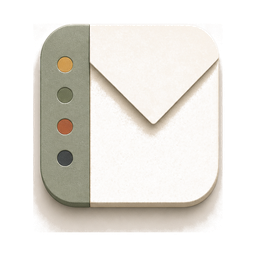
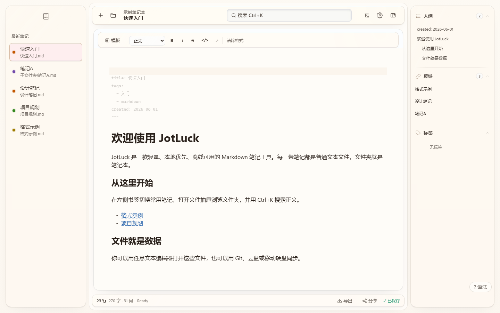

<p align="center">
  <a href="./README.md">English</a> · <a href="./README.zh.md">简体中文</a>
</p>

<p align="center">
  
</p>

<h1 align="center">JotLuck</h1>

<p align="center">
  <strong>Files are notes. Folders are notebooks.</strong><br>
  A lightweight, local-first Markdown notebook for Windows that works offline.
</p>

<p align="center">
  <a href="https://github.com/jiay98528-dev/JotLuck/releases"></a>
  <a href="./LICENSE"></a>
  <a href="https://github.com/jiay98528-dev/JotLuck/actions/workflows/ci.yml"></a>
  
</p>

<p align="center">
  <a href="https://jotluck.com/en/"><strong>Official website</strong></a>
  · <a href="https://jotluck.com/en/download"><strong>Download</strong></a>
  · <a href="https://github.com/jiay98528-dev/JotLuck/releases">GitHub Releases</a>
  · <a href="#get-started-in-three-steps">Get started</a>
  · <a href="./SUPPORT.md">Support</a>
  · <a href="./PRIVACY.md">Privacy</a>
  · <a href="./CODE_SIGNING.md">Code signing policy</a>
  · <a href="https://github.com/jiay98528-dev/JotLuck/issues/new/choose">Send feedback</a>
</p>

JotLuck is a local-first Markdown notebook for Windows.
Notes are plain files in a folder you own. No account. No database. Nothing uploaded.

It opens and renders Markdown in seconds, beautifully. Read-only preview or full editing, a workspace arranged your way — your call.

For everyone who works with text, and everyone who works with AI.

Current status: `v0.11.2-preview`, a public Windows preview. Tested, usable, unsigned.

> **Download notice:** Official installers appear only on [GitHub Releases](https://github.com/jiay98528-dev/JotLuck/releases). The `v0.11.2-preview` installer is available there now — unsigned, so verify its SHA-256 before installing. Please don't download JotLuck from anywhere else.

<p align="center">
  
  <br>
  <sub>The JotLuck workspace using the built-in Halo Canvas theme</sub>
</p>

## Your notes remain yours

Every note is an ordinary file: `.md`, `.markdown`, `.mdx`, or `.txt`. Any editor can open it. Any sync tool can carry it. If you stop using JotLuck tomorrow, your notes are already where they belong.

| What matters     | How JotLuck handles it                                             |
| ---------------- | ------------------------------------------------------------------ |
| File ownership   | Reads and writes the local folder you choose. No note database     |
| Privacy          | Editing, search, and completion work offline                       |
| Longevity        | Open plain-text formats, ready for any tool that comes next        |
| Writing workflow | Live Preview, links, backlinks, local search, on-device completion |
| Release trust    | Official builds appear only on GitHub Releases                     |

## Get started in three steps

1. **Get the app.** The public preview installer lives on [GitHub Releases](https://github.com/jiay98528-dev/JotLuck/releases) — the only official source. Developers can build from source below.
2. **Choose file opening on the Welcome screen.** Markdown is suggested; text, Word, PDF, and Excel remain unchecked. Windows applies only the choices you confirm in Default Apps.
3. **Open a folder.** The Open Notebook gate turns any folder into a notebook. `Ctrl/Cmd+O` switches anytime, and notes save directly into that folder.

The installer registers `.md`, `.markdown`, `.mdx`, `.txt`, `.docx`, `.pdf`, `.xlsx`, and `.xls` as optional Open With choices. Installation and upgrade never replace a Windows default application.

## What it's like to write in JotLuck

- **Instant from the first second.** Double-click a Markdown file and read it beautifully rendered. Editing is optional; the workspace is yours to arrange.
- **Bring documents without locking them in.** Open `.docx`, `.pdf`, `.xlsx`, or `.xls` in a read-only semantic preview, continue in the detected professional editor, or save a new Markdown copy for editing in JotLuck. The source document is never overwritten.
- **A focused editor.** CodeMirror 6, Live Preview, block-level editing, keyboard-first.
- **Notes that know each other.** `[[Wiki-links]]`, aliases, backlinks, tags, outlines.
- **Find anything.** Local search by keyword, regex, tag, date, or folder.
- **Start faster.** Templates with `{{date}}`. Pasted images land in `assets/` with relative paths.
- **Six ways out.** Export to PDF, DOCX, XLSX, CSV, TXT, and HTML — straight into your existing workflow.
- **A quiet helper.** Offline ghost-text completion. Tab to accept.
- **Deep themes.** Six bundled theme configurations, with more on the way. A theme here reshapes far more than colors — it redefines how the workspace feels.
- **At home on Windows.** Native file watching, system dialogs, multi-window. Built on Tauri 2.

## Privacy and data safety

- Your notes live in the folder you picked.
- No uploads. No account.
- Update checks are optional, and only ever query public release information.
- Deleting a note keeps its images; assets can be shared between notes.
- Keep your own backup before bulk operations.

Report vulnerabilities through a [private GitHub security report](https://github.com/jiay98528-dev/JotLuck/security/advisories/new). Do not attach private notes or real folder information to a public issue. See the [Security Policy](./SECURITY.md).

See the full [Privacy Policy](./PRIVACY.md) and the identity and integrity process for official Windows artifacts in the [Code Signing Policy](./CODE_SIGNING.md).

## Current release scope

| Item                     | Current scope                                                                                                                 |
| ------------------------ | ----------------------------------------------------------------------------------------------------------------------------- |
| Current version          | `v0.11.2-preview`                                                                                                             |
| Release stage            | Public preview, unsigned; not a stable release                                                                                |
| Candidate platform       | Windows x64                                                                                                                   |
| Desktop runtime          | Tauri 2 and Microsoft Edge WebView2                                                                                           |
| Editable note formats    | `.md`, `.markdown`, `.mdx`, `.txt`                                                                                            |
| Read-only import formats | `.docx`, `.pdf`, `.xlsx`, `.xls`; semantic Markdown preview, not pixel-perfect Office/PDF layout                              |
| File associations        | All eight extensions are optional Open With choices; installation and upgrade never replace the user's Windows default choice |
| License                  | MIT                                                                                                                           |

macOS and Linux packages have not completed host-specific packaging, signing, and release validation. Read [Known Limitations](./KNOWN_LIMITATIONS.md) and the notes attached to each release before installing.

## Frequently asked questions

<details>
<summary><strong>Is JotLuck free?</strong></summary>

The core source code is MIT-licensed. Free to use, inspect, modify, and share.

</details>

<details>
<summary><strong>Does JotLuck upload my notes?</strong></summary>

No. Notes, indexes, and completion data stay on your device.

</details>

<details>
<summary><strong>How do I sync between devices?</strong></summary>

Put the notebook folder in the sync tool you already trust: OneDrive, Syncthing, Git, anything.

</details>

<details>
<summary><strong>Can I open an existing Markdown folder?</strong></summary>

Point JotLuck at it and start reading. Keep a backup first.

</details>

## Support and feedback

- Troubleshooting and support: [SUPPORT.md](./SUPPORT.md)
- Product boundaries: [KNOWN_LIMITATIONS.md](./KNOWN_LIMITATIONS.md)
- Report a bug: [Bug report](https://github.com/jiay98528-dev/JotLuck/issues/new?template=bug_report.yml)
- Suggest an improvement: [Feature request](https://github.com/jiay98528-dev/JotLuck/issues/new?template=feature_request.yml)
- Report a vulnerability privately: [Security advisory](https://github.com/jiay98528-dev/JotLuck/security/advisories/new)

<details>
<summary><strong>Developers: local setup and project documentation</strong></summary>

### Requirements

- Node.js 20+
- pnpm 9+; the repository currently pins pnpm 11.x
- Rust 1.88+ for desktop development and packaging
- Tauri and WebView2 build dependencies on Windows

### Start the web development build

```powershell
pnpm.cmd install
pnpm.cmd --filter @jotluck/app dev
```

### Start the desktop development build

```powershell
pnpm.cmd --filter @jotluck/app tauri:dev
```

### Common checks

```powershell
pnpm.cmd --filter @jotluck/app typecheck
pnpm.cmd --filter @jotluck/app test
pnpm.cmd --filter @jotluck/app build
pnpm.cmd audit --prod --audit-level high
```

A public release also requires installed-app validation, a Rust dependency audit, and manual GUI journeys. See the [release gate](./doc/release-rc-gate.md).

Project documentation:

- [Product requirements](./doc/PRD.md)
- [Technical architecture](./doc/TAD.md)
- [Changelog](./CHANGELOG.md)
- [Release notes](./RELEASE_NOTES.md)
- [Security policy](./SECURITY.md)
- [Privacy policy](./PRIVACY.md)
- [Code signing policy](./CODE_SIGNING.md)
- [Contribution guide](./CONTRIBUTING.md)

</details>

## Copyright and license

JotLuck source code is available under the [MIT License](./LICENSE).

Copyright © 2026 鸰湖科技（深圳）有限公司<br>
Linghu Technology (Shenzhen) Co., Ltd.
